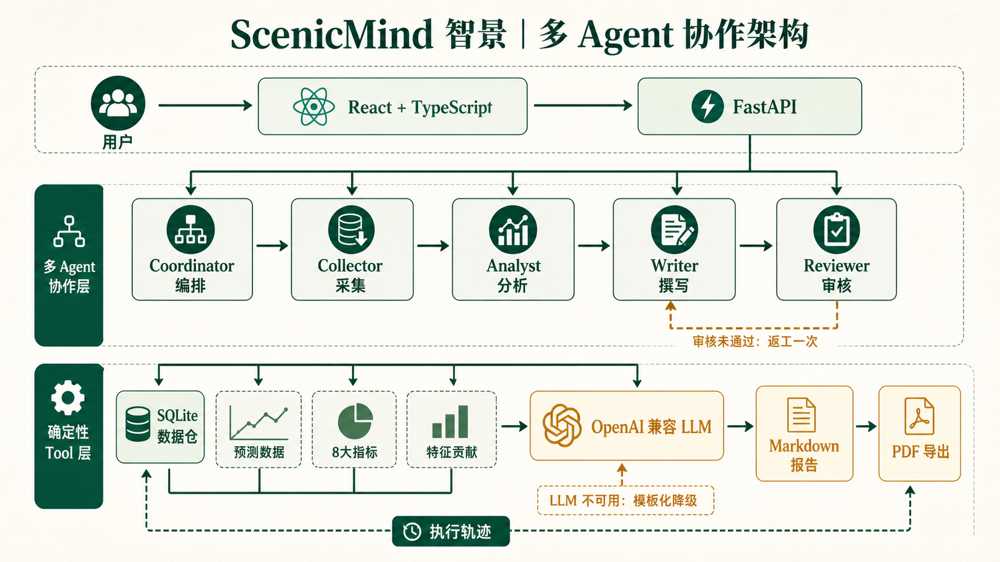

# ScenicMind 智景｜路演技术手册

> 景区客流预测、经营指标分析与多 Agent 决策报告平台  
> 版本：基于 2026-08-30 当前代码与模型产物核验  
> 使用场景：项目路演、技术答辩、评委追问、团队交接

## 0. 一句话讲清项目

ScenicMind 把景区历史客流、日历节假日、天气、网络热度、预约承载和交通事件转化为可预测、可解释、可执行的经营决策：FlowStack 负责给出未来 7/14/30 天客流预测，指标蓝图负责解释经营状态，多 Agent 系统负责把确定性数据组织成经过审核的管理报告。

路演时可以用这句话概括技术价值：

> 我们不是单纯做一条预测曲线，而是把“数据接入—预测—解释—建议—审核—交付”做成了一条完整、可降级、可追踪的决策链路。

## 1. 当前已经实现的产品边界

### 1.1 已打通的主链路

1. 用户注册、登录，获得 7 天有效的 Bearer Token。
2. 上传 CSV、XLSX、XLS、JSON 或 Parquet 文件，单文件不超过 50 MB。
3. 后端完成文件校验、字段识别、日期与客流标准化、重复日期处理、未来数据过滤和数据质量警告。
4. 加载 FlowStack 模型，对历史尾部做回测，并递归生成未来 30 天预测。
5. 输出未来 7/14/30 天的均值、峰值、谷值，以及 MAE、RMSE、MAPE。
6. 独立计算经营指标蓝图和特征贡献度，并分别存储。
7. React 看板展示真实客流、预测曲线、数据源状态、8 个经营模块和贡献度解释。
8. 用户可发起每日简报、深度分析、周期报告；五阶段 Agent 工作流异步生成 Markdown 报告，可下载 PDF。
9. Agent 生成过程中，前端实时轮询并展示执行阶段；LLM 不可用时自动降级为确定性模板报告。

### 1.2 路演中必须诚实说明的边界

- 当前上传分析接口在一次 HTTP 请求中同步执行数据解析和预测，适合演示与中小数据集；生产环境应迁移到任务队列。
- Agent 工作流是纯 Python 状态机，不依赖 LangGraph。这样减少了黑客松环境依赖和故障面，但后续可以平滑迁移到工作流引擎。
- Coordinator 当前执行确定性路由；注册表预留了 LLM 能力，但当前版本优先保证低延迟、可控和可复现。
- Agent 的“归因”是基于模型贡献和指标交叉验证的经营解释，不等同于严格因果推断。
- 模型评估数据中的部分天气与微信搜索特征来自模拟补全，真实部署必须用景区实际数据重新训练和验证。

## 2. 总体技术架构

### 2.1 四层架构

**交互层**：React 19 + TypeScript + Vite，负责注册登录、文件上传、预测看板、指标蓝图、经营分析、Agent 报告、报告历史和 PDF 下载。

**业务 API 层**：FastAPI 提供鉴权、分析、指标、贡献度、Agent 报告、Agent 对话和 PDF 导出接口；CORS 来源可通过环境变量配置。

**算法与智能层**：

- FlowStack：客流预测、回测、特征重要性与场景校正。
- Indicator Engine：从上传 DataFrame 动态计算经营指标。
- Multi-Agent：Coordinator、Collector、Analyst、Writer、Reviewer 五阶段协作。
- LLM Client：通过 OpenAI 兼容的 `/chat/completions` 协议访问可替换模型服务。

**数据与持久化层**：SQLite 保存用户、会话、分析记录、预测结果、贡献度、指标和 Agent 报告；原始上传文件按用户与 analysis_id 隔离存放；训练模型以 joblib + metadata.json 形式加载。

### 2.2 核心设计原则

1. **预测与生成式 AI 解耦**：数值由确定性算法和数据库提供，LLM 只负责分析组织与语言表达。
2. **预测与解释解耦**：看板主体只返回预测事实，特征贡献走独立接口，避免解释计算阻塞主链路。
3. **真实数据优先**：缺失天气、预约、承载、公告、热度时显示“待配置真实数据源”，不伪造字段。
4. **时间安全**：滞后和滚动特征只使用目标日前可见数据；冗余选择和模型训练只在训练集拟合。
5. **可降级**：FlowStack 加载失败时使用季节滞后模型；LLM 不可用时使用模板化数据简报。
6. **可审计**：每个分析和报告都有唯一 ID、状态、完成时间和 Agent 执行轨迹。

## 3. 端到端技术路线

### 3.1 用户与鉴权流程

1. 注册接口验证用户名、邮箱格式和密码长度。
2. 密码使用 PBKDF2-HMAC-SHA256，随机 16 字节盐，240,000 次迭代后存储。
3. 登录成功生成高熵随机 Token；数据库只保存 Token 的 SHA-256 摘要，不保存明文。
4. 前端请求统一附加 `Authorization: Bearer <token>`。
5. 后端根据摘要查询会话与用户，并检查 7 天过期时间。
6. 所有分析和报告查询同时校验 `user_id`，避免跨用户读取。

### 3.2 数据上传与标准化流程

输入约束：

- 文件格式：CSV、XLSX、XLS、JSON、Parquet。
- 文件大小：最大 50 MB。
- 最低样本量：至少 21 天。
- 必需语义：日期列与真实客流列。

字段适配：

- 日期别名：`date`、`日期`、`day`、`ds`、`时间`、`统计日期`。
- 客流别名：`visitors`、`客流量`、`游客量`、`游客人数`、`入园人数`、`visitor_count`、`actual_visitors`、`y`。
- CSV 编码按 UTF-8 BOM、UTF-8、GB18030 顺序尝试。
- Excel 数字日期可按 1899-12-30 基准转换。

清洗规则：

1. 标准化列名、日期和客流数值，移除千分位逗号。
2. 删除日期或客流为空、客流非有限值、客流小于 0 的记录。
3. 重复日期按日期排序后保留最后一条，并记录警告。
4. 晚于上传当天的数据不作为真实值，防止未来数据穿越。
5. 计算缺失日期数量；少于 60 天时提示稳定性风险。
6. 保留上传文件中真实存在的天气、预约、承载、公告、搜索等扩展字段。

### 3.3 特征工程路线

ScenicMind 的特征分为六个业务主题：历史客流、日历节假日、天气条件、网络关注度、预约与运营、交通可达性。

**历史客流特征**：

- 滞后：1、2、3、7、14、28、365 天。
- 滚动均值：3、7、14、28 天。
- 滚动中位数、标准差、最小值、最大值、分位数。
- 趋势强度、昨日与 7 日均值比、7 日滞后与 28 日均值比。
- 所有滚动统计先 shift(1)，避免把当天目标泄漏到当天特征。

**日历与季节特征**：

- 年、月、日、星期、年内日、周序号、季度。
- 周末、休息日、调休、月初/月末。
- 春节、国庆等法定节假日名称、假期第几天、假期长度、距下一个假期天数。
- 暑假、寒假、旺季、淡季。
- 年周期和周周期正余弦编码。

**天气特征**：

- 温度范围、降雨、暴雨、降雪、极寒、极热、恶劣天气标记。
- 3 日和 7 日累计降雨。
- 预测场景只使用目标日前已知或滞后的天气数据。

**网络关注度特征**：

- Wikimedia 中英文页面浏览量、微信搜索指数等。
- 使用 lag1、lag7、MA7、MA14、7 日增长率，避免同日关注度泄漏。

**运营与公告特征**：

- 售罄、关闭、恢复、局部开放、优惠、免票、限流。
- 预约人数、日承载量、预约压力比。
- 预测安全版本只纳入目标日前 23:59 已公开的公告。

**交通事件特征**：

- 黄龙九寨高铁开通标记及开通后天数。
- 九绵高速开通标记及开通后天数。

### 3.4 FlowStack 训练路线

FlowStack 的目标不是简单叠加模型，而是针对景区客流“周期明显、节假日尖峰强、承载有上限”的特点设计。

1. **时间切分**：按时间顺序 80% 训练、20% 测试，不随机打乱；测试集为真正的时间外样本。
2. **冗余感知选择**：在训练集上计算 Spearman 相关性，绝对相关系数达到 0.90 的特征归为同一簇；簇内按与目标的互信息选择代表特征。模型由 61 个原始特征降至 46 个，减少共线性与重要性稀释。
3. **差分目标**：学习 `delta = visitors - visitors_lag_1`，再标准化。模型预测的是相对昨日的修正量，最终加回昨日客流。这样把“持续性基线 + 变化修正”显式写入结构。
4. **场景加权**：普通日权重 1.0，周末 1.15，暑期 1.25，法定节假日 1.5，限流场景 1.25，强化高价值和高误差场景。
5. **四路基学习器**：LightGBM-Huber、XGBoost-Huber、LightGBM-L1、CatBoost-Huber。Huber/L1 对节假日极端尖峰比 L2 更稳健。
6. **前向 OOF 堆叠**：使用 TimeSeriesSplit(5) 生成 out-of-fold 预测，避免元学习器看到基模型在自身训练样本上的乐观输出。
7. **正约束 Ridge 融合**：元学习器权重非负，既减少过拟合，又能解释各基模型贡献。当前产物权重为 CatBoost 0.7095、XGBoost 0.2905，两路 LightGBM 被自动压为 0。
8. **场景残差校正**：在 OOF 残差上学习节假日、周末、旺季等场景的系统偏差；样本少于 8 不校正，使用 shrinkage=30，并把绝对校正限制在 6,000 人以内。
9. **物理约束**：预测不低于 0；存在日承载量时不高于承载上限。
10. **模型产物**：保存 `model.joblib`、模型元数据、特征清单、融合权重和模型版本，后端采用 LRU 单例缓存加载。

### 3.5 在线推理与未来 30 天预测

1. 读取模型与最新历史数据。
2. 取历史尾部作为验证区间，逐日构造当时可见特征，生成回测预测。
3. 从历史最后一天开始逐日递归：预测第 1 天后，把预测值追加到 history，再构造第 2 天的滞后和滚动特征，直到第 30 天。
4. 聚合前 7、14、30 天的日均、峰值和最低值。
5. 返回最近 60 天真实值和回测值，供前端绘制“历史—预测”连续曲线。
6. 若模型文件或科学计算依赖不可用，自动切换 SeasonalLagFallback：综合同星期历史、14 日滞后、7 日均值、近期趋势和周末因子。

### 3.6 模型评估结果

评估协议：2,377 天 × 56 列数据；训练 1,901 天，测试 476 天；TimeSeriesSplit(5)；与基线使用相同随机种子和指标实现。

| 模型 | R² | MAPE | WAPE | RMSE | MAE |
|---|---:|---:|---:|---:|---:|
| FlowStack | 0.8858 | 13.26% | 10.66% | 3661.2 | 2270.1 |
| XGBoost 基线 | 0.8709 | 15.40% | 12.82% | 3892.6 | 2729.7 |
| LightGBM 基线 | 0.8665 | 15.76% | 13.64% | 3958.2 | 2904.0 |
| RandomForest 基线 | 0.8586 | 15.19% | 13.01% | 4074.0 | 2768.8 |
| LSTM 基线 | 0.8578 | 14.25% | 11.12% | 4085.2 | 2366.8 |

对评委的解释：R² 说明模型解释了约 88.6% 的时间外波动；MAPE 约 13.26%，表示典型情况下相对误差量级约为 13%；MAE 约 2,270 人，必须结合景区日均客流和承载规模理解。模型在五项指标上分别超过各自最强基线，而不是只优化单一指标。

## 4. 指标蓝图技术路线

指标引擎从标准化 DataFrame 动态计算，不依赖固定文件名。前端称“8 大模块”，具体由 7 个指标数据模块加 1 个模型准确率模块组成。

1. **客流趋势**：最新客流、总量、均值、中位数、P95、同比、环比、7 日均值、波动和近 30 日序列。
2. **承载与售罄**：最新/平均/最大载客率、超承载天数、近满载天数、售罄率、限流率、预约量和公告数。
3. **预测准确率**：MAPE、MAE、验证天数，由回测模块提供。
4. **节假日效应**：节假日与非节假日日均、提升率、旺淡季、寒暑假和各假期逐日曲线。
5. **天气影响**：雨天/晴天客流、降水影响、恶劣天气影响和温度区间。
6. **交通基建**：高铁和高速开通前后日均客流、提升率和开通累计天数。
7. **网络热度**：中英文百科浏览、微信热度以及与客流的相关系数。
8. **数据质量**：行列数、日期跨度、缺失日期、封顶天数、缺失列和异常尖峰。

注意：相关系数、前后均值和模型贡献用于发现线索，不应直接表述为严格因果效应。路演时说“影响线索”或“模型依赖”，不要说“证明了因果关系”。

## 5. 多 Agent 协作架构

### 5.1 为什么需要多个 Agent

单一 Agent 同时读取数据、分析、写作和自我审查，容易混淆职责，并放大幻觉。ScenicMind 把任务拆成“编排—采集—分析—撰写—审核”，每一阶段有独立输入输出和温度配置，确定性数据与生成式推理严格分开。

### 5.2 五个角色及输出契约

| Agent | 当前职责 | 是否调用 LLM | 主要输出 |
|---|---|---:|---|
| Coordinator | 校验报告类型、周期与主题，确定工作流 | 当前否，注册表预留 | 路由决策与 trace |
| Collector | 调用三个确定性 Tool，从 SQLite 采集数据 | 否 | forecast + indicators + importance + gaps |
| Analyst | 交叉验证预测、指标和贡献度 | 是 | insights、risks、actions 的 JSON |
| Writer | 按报告类型将结构化要点写成业务报告 | 是 | Markdown |
| Reviewer | 校验数字、章节和建议可执行性 | 是 | pass 与 issues JSON |

### 5.3 确定性 Tool 层

Collector 不访问开放互联网，也不让 LLM自行查数，而是调用三个受控工具：

- `tool_forecast`：读取最新真实客流、未来预测、7/14/30 天摘要、模型指标和数据来源。
- `tool_indicators`：读取指标蓝图；历史记录缺失指标时才从已保存原始文件补算。
- `tool_importance`：读取业务主题贡献度和 Top10 特征。

这层的价值是把“事实”锁定在数据库里。LLM 接收到的是压缩后的数据包，不具备修改预测结果的权限。

### 5.4 报告生成状态机

1. 前端 `POST /api/v1/agent/report`，后端创建 report_id，状态设为 running。
2. 后端启动守护线程执行报告工作流，HTTP 立即返回 202。
3. Coordinator 记录报告类型、周期、主题。
4. Collector 采集三类数据并记录缺口数量。
5. Analyst 根据 `daily_brief`、`deep_dive` 或 `periodic` 使用不同提示词，输出结构化 JSON。
6. Writer 使用对应报告结构生成 Markdown。
7. Reviewer 检查：所有数字是否能在数据包中找到、章节是否完整、建议是否具体。
8. 审核不通过时，把 issues 与数据包返回 Writer，最多返工一次。
9. 每阶段通过回调更新 `trace_json`，前端每 1.2 秒轮询状态并展示。
10. 完成后保存 Markdown，可由 ReportLab 转换为中文 PDF。

### 5.5 三种报告与轻量对话

- **每日简报**：300–500 字，聚焦当日数据、异常和行动，适合晨会。
- **深度分析**：600–1,200 字，包含趋势、归因链、风险、机会和建议。
- **周期报告**：500–900 字，可选 7/14/30 天，强调阶段对比和周期规律。
- **Agent Chat**：Collector + 单轮 LLM，不经过 Writer/Reviewer，目标是低延迟问答，回答不超过 300 字。

### 5.6 防幻觉与容错设计

1. Prompt 明确要求所有数字必须来自数据包。
2. Analyst 使用 JSON Mode，Writer 只接收 Analyst 结构化结果与压缩数据摘要。
3. Reviewer 逐项检查数值一致性，发现一个编造数字即不通过。
4. 只允许一次受控返工，防止无限循环和成本失控。
5. LLM 请求超时为 90 秒，模型、服务地址、API Key 均通过环境变量配置。
6. LLM 不可用时返回由数据库字段直接拼接的模板简报，保证演示不白屏。
7. 数据缺失显式写入 `gaps`，报告不能把缺失字段描述成已接入。

## 6. 后端与数据契约

### 6.1 主要 API

| 路径 | 方法 | 作用 |
|---|---|---|
| `/health` | GET | 服务健康检查 |
| `/api/v1/auth/register` | POST | 注册并创建会话 |
| `/api/v1/auth/login` | POST | 登录 |
| `/api/v1/auth/me` | GET | 获取当前用户 |
| `/api/v1/auth/logout` | POST | 注销 Token |
| `/api/v1/analyses` | POST | 上传文件并执行分析 |
| `/api/v1/analyses` | GET | 历史分析列表 |
| `/api/v1/analyses/latest` | GET | 最新分析 |
| `/api/v1/analyses/{id}` | GET | 指定分析结果 |
| `/api/v1/analyses/{id}/importance` | GET | 特征贡献度 |
| `/api/v1/analyses/{id}/indicators` | GET | 指标蓝图 |
| `/api/v1/agent/report` | POST | 异步创建报告 |
| `/api/v1/agent/report/{id}` | GET | 报告状态与内容 |
| `/api/v1/agent/report/{id}/pdf` | GET | 下载 PDF |
| `/api/v1/agent/reports` | GET | 报告历史 |
| `/api/v1/agent/chat` | POST | 轻量问答 |

### 6.2 SQLite 数据模型

**users**：用户 ID、用户名、邮箱、密码哈希、创建时间。

**sessions**：Token 摘要、用户 ID、创建时间、过期时间；外键级联删除。

**analyses**：分析 ID、用户 ID、原文件名、存储路径、状态、错误、时间、预测 JSON、贡献度 JSON、指标 JSON。

**agent_reports**：报告 ID、用户 ID、分析 ID、报告类型、状态、问题、周期、Markdown、执行轨迹、创建与完成时间。

预测、指标、贡献度分列存储的原因：它们面向不同消费者、更新频率不同，也能避免看板主接口负载被特征解释数据放大。

## 7. 前端技术路线

前端使用 React 19、TypeScript、Vite 7，不依赖大型状态管理或图表库，以原生 SVG 和组件完成可视化，降低打包体积和演示风险。

页面流程：

1. `/register` 注册后主动注销，避免注册与登录语义混淆。
2. `/login` 保存 Token 和用户摘要。
3. `/upload` 校验格式与大小、上传单文件、显示历史分析。
4. `/dashboard` 根据 localStorage 中 activeAnalysisId 加载指定分析，否则加载最新分析。
5. 并行请求预测、指标和贡献度，分别呈现数据看板、指标蓝图、经营分析、Agent 报告四个视图。
6. Agent 报告页创建任务后轮询状态，展示阶段、历史列表、Markdown 内容、对话和 PDF 下载。

前端生产构建结果：42 个模块，JavaScript 约 256 KB（gzip 约 79.6 KB），CSS 约 46.1 KB（gzip 约 9.3 KB）。

## 8. 可靠性、安全与可运维性

### 8.1 当前已经具备

- 文件类型白名单、50 MB 限制、安全文件名、按用户目录隔离。
- PBKDF2 密码哈希、Token 摘要存储、HMAC 常量时间比较。
- 会话有效期、接口鉴权、查询附带 user_id。
- 上传失败和分析失败状态落库，错误信息截断保存。
- 模型与 LLM 双重降级。
- CORS 来源环境变量化，LLM API Key 不写入仓库。
- FastAPI 自动 OpenAPI 文档。
- 模型版本、训练日期、特征清单和融合权重可追踪。

### 8.2 生产化需要补强

- 把 SQLite 升级为 PostgreSQL，把原始文件迁移到对象存储。
- 把同步分析和 Python 守护线程迁移到 Celery/RQ/Arq + Redis，增加重试、超时、幂等和并发控制。
- 前端 Token 从 localStorage 迁移到 HttpOnly Secure Cookie，补充 CSRF 防护。
- 增加 API 限流、文件病毒扫描、审计日志、密钥轮换和敏感字段脱敏。
- 模型监控增加数据漂移、特征缺失、预测偏差、分场景误差和告警阈值。
- Agent 增加结构化引用定位、成本/Token 监控、Prompt 版本、离线评测集和人工确认节点。

## 9. 测试与验证证据

本次文档生成前已按当前代码实际验证：

- 前端 `npm run build` 成功：TypeScript 校验与 Vite 生产构建通过。
- 后端 `python -m pytest -q` 主链路测试 2/2 通过。
- 集成测试覆盖：健康检查、注册、登录、鉴权上传、30 天预测、7/14/30 天摘要、数据源识别、特征贡献、注销、短数据拒绝。
- 模型性能结果来自固定时间外测试集和同协议基线对比文件。

路演中不要说“系统已经达到生产级高可用”；更准确的表达是：“核心业务闭环已完整跑通，关键算法与主链路有测试，生产化扩展路径明确。”

## 10. 路演讲解顺序（8 分钟版本）

### 第 1 分钟：问题与定位

“景区管理者面对的不是有没有数据，而是数据分散、预测孤立、结果难解释、建议难落地。ScenicMind 把客流预测、经营指标和 Agent 报告串成一条决策链。”

### 第 2 分钟：现场演示主链路

“用户上传历史客流及可选扩展字段。后端不伪造缺失数据，而是明确标记接入状态。系统自动完成标准化、预测、指标计算和贡献度分析。”

### 第 3–4 分钟：FlowStack

“模型不是单一 XGBoost。我们先做时间安全特征，再用相关聚类和互信息把 61 维降到 46 维；学习相对昨日的差分目标；四路稳健树模型通过 TimeSeriesSplit 的 OOF 预测交给正约束 Ridge 融合；最后做有样本门槛、有收缩、有上限的场景校正和承载约束。时间外测试 R² 0.8858、MAPE 13.26%，五项指标均超过各自最强基线。”

### 第 5 分钟：指标蓝图

“预测告诉我们将发生什么，指标蓝图解释当前经营状态。8 个模块覆盖客流、承载、准确率、节假日、天气、交通、热度和数据质量。缺什么数据就明确告诉用户需要接什么源。”

### 第 6–7 分钟：多 Agent

“我们把事实和语言模型分开。Collector 只能从三个确定性 Tool 取数，Analyst 输出结构化洞察，Writer 按报告类型写作，Reviewer 检查每个数字和建议。不通过只返工一次。LLM 掉线时退化为模板简报，系统仍可交付。”

### 第 8 分钟：价值与扩展

“现在系统已经完成从文件到预测、从预测到报告、从报告到 PDF 的闭环。下一步把本地数据库和线程任务升级成云端数据仓与任务队列，并接入景区票务、天气和公告实时源。”

## 11. 评委高频问题与回答口径

### Q1：为什么不用单一 XGBoost？

不同模型对绝对误差、相对误差和节假日尖峰的偏好不同。FlowStack 用 OOF 堆叠让 CatBoost 和 XGBoost互补，正约束 Ridge 自动压低无增益模型，当前权重约 71%/29%。时间外测试的五项指标同时超过最强基线，说明不是只优化一个数字。

### Q2：如何避免数据泄漏？

时间不随机打乱；滞后和滚动先 shift；百科和搜索使用滞后值；公告按目标日前可见时间过滤；相关聚类、互信息、基模型和校正器只在训练或 OOF 数据上拟合；测试集是时间外 476 天。

### Q3：30 天递归预测会不会误差累积？

会，这是所有递归多步预测的固有风险。当前方案通过周/年周期特征、稳健损失和承载约束降低发散，并同时输出 7/14/30 天不同窗口。生产版可进一步训练直接多步模型或多输出模型，并给出分位数区间。

### Q4：多 Agent 是不是只是五个 Prompt？

不是。系统有明确状态机、角色输入输出、确定性 Tool、异步任务、数据库状态、前端轨迹、审核返工和 LLM 降级。Agent 之间的差异不只在 Prompt，也在访问权限和数据契约。

### Q5：怎样保证 Agent 不编数字？

LLM 不能直接查数据库，只能接收 Collector 生成的数据包；Analyst 结构化输出；Reviewer 要求每个数字都能在数据包找到；失败返工；LLM 不可用时直接使用确定性模板。后续还会把数值引用升级为程序化逐项校验。

### Q6：为什么不用 LangGraph？

当前五阶段链路是固定 DAG，纯 Python 状态机依赖少、启动快、便于演示和排错。接口和 trace 已按工作流思路设计，未来需要分支、并行、持久化检查点时再迁移 LangGraph，不会改变 Tool 和 Agent 契约。

### Q7：模型重要性等于因果关系吗？

不等于。它表示模型对特征的依赖程度。系统把技术特征汇总成六个业务主题，再与指标蓝图交叉验证，用于形成经营假设；真正的因果结论仍需要实验、自然实验或更严格的因果模型。

### Q8：数据缺失怎么办？

必需的日期和客流缺失会拒绝分析；可选天气、预约、承载、公告和热度缺失时不伪造，前端显示待配置。模型使用训练时填充值和历史特征继续工作，Agent 在 gaps 中披露缺口。

### Q9：系统如何扩展到不同景区？

数据标准化基于语义别名，指标引擎基于列存在性，模型目录和运行目录可通过环境变量切换。真正迁移时需要用目标景区数据重新训练、校准节假日和承载规则，并配置景区经纬度、票务和公告适配器。

### Q10：系统目前最大的技术风险是什么？

一是外部真实数据接入完整度；二是递归长周期误差；三是 LLM 报告的程序化数值核验还可增强；四是当前同步分析和本地 SQLite 不适合高并发。我们已经为每项风险定义了明确的生产化路线。

## 12. 可继续升级的路线图

**阶段 A：工程生产化**：PostgreSQL、对象存储、Redis 任务队列、容器化、观测告警、权限与审计。

**阶段 B：数据实时化**：票务预约、闸机、天气预报、公告、交通、搜索热度的定时采集和数据质量 SLA。

**阶段 C：模型升级**：直接多步预测、分位数/Conformal 区间、按景区分层模型、漂移检测和自动回训。

**阶段 D：Agent 可信化**：数值引用程序校验、证据链接、Prompt/模型版本评测、人工审批、多 Agent 并行研究和成本预算。

## 13. 技术栈速查

- 前端：React 19、TypeScript 5.9、Vite 7、原生 SVG/CSS。
- 后端：Python 3.11+、FastAPI、Uvicorn、Pydantic、SQLite。
- 数据：pandas、NumPy、OpenPyXL、xlrd、PyArrow。
- 模型：LightGBM、XGBoost、CatBoost、scikit-learn Ridge、joblib。
- Agent：纯 Python 状态机、OpenAI 兼容 Chat Completions、JSON Mode、ReportLab PDF。
- 测试：pytest、FastAPI TestClient、TypeScript/Vite 生产构建。

## 14. 代码入口速查

- `backend/app/routers/analyses.py`：上传、分析、指标与贡献度接口。
- `backend/app/services/dataset.py`：数据读取、标准化与数据源状态。
- `backend/app/services/forecast.py`：在线回测、递归预测、降级模型和数据契约。
- `backend/app/services/indicators.py`：指标蓝图计算引擎。
- `scenicmind/flowstack/model.py`：FlowStack 训练、预测、重要性和保存加载。
- `scenicmind/flowstack/redundancy.py`：相关聚类与互信息代表选择。
- `backend/app/agent/graph.py`：五阶段 Agent 状态机。
- `backend/app/agent/tools.py`：三个确定性 Tool。
- `backend/app/agent/prompts.py`：报告类型差异化提示词与审核规范。
- `backend/app/routers/agent.py`：异步报告、轮询、PDF 和对话 API。
- `frontend/src/features/dashboard/pages/DashboardPage.tsx`：四视图看板和 Agent 交互。

---

### 最后一句收束

ScenicMind 的技术核心不是“用了大模型”，而是把确定性预测、可解释指标和受控生成式工作流组合成一个能在真实业务里被验证、被追踪、被降级的景区决策系统。
